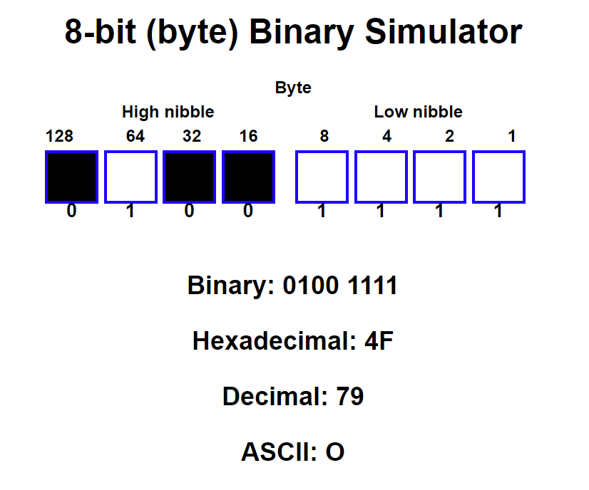

# 8-bit (byte) Binary Simulator

The 8-bit (byte) [Binary Simulator](index.html) is a simple web application that allows users to toggle individual bits and see their corresponding decimal, hexadecimal, and ASCII values.

## Features

- 8 clickable bit panels, arranged in two nybbles (high and low)
- Toggling bit panels between black (0) and white (1)
- Displays binary, decimal, hexadecimal, and ASCII representation of the byte
- Automatic updates to output values when bit panels are toggled

## Usage

To use the [Binary Simulator](index.html), simply open `index.html` in your web browser. Click on the bit panels to toggle their values between 0 and 1. The output values for binary, decimal, hexadecimal, and ASCII will be updated automatically as you toggle the bits.

## Files

- `index.html`: Main HTML file for the Binary Simulator
- `styles.css`: Stylesheet for the Binary Simulator
- `scripts.js`: JavaScript file that handles the toggling of bits and updating output values

## Credits

The RGB Color Picker was created by [ChatGPT 4] using the following resources:

- [W3Schools](https://www.w3schools.com/) for HTML, CSS, and JavaScript tutorials and references
- [MDN Web Docs](https://developer.mozilla.org/) for additional HTML, CSS, and JavaScript references

## License

The RGB Color Picker is licensed under the [MIT License](LICENSE).
